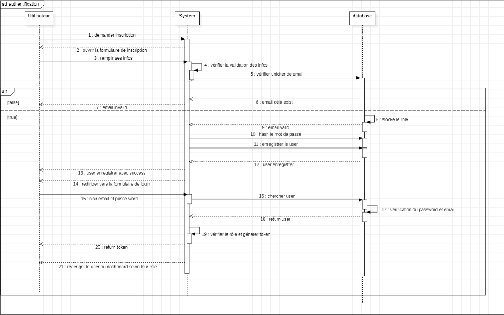

# **📦 ColisConnect**

**ColisConnect** est une application web full-stack qui facilite la mise en relation entre conducteurs et expéditeurs de colis. Grâce à un système de co-transport collaboratif, la plateforme permet d’optimiser les trajets, de réduire les coûts logistiques et de contribuer à une livraison plus respectueuse de l’environnement.

### **📌 Table des matières**

✨ Fonctionnalités

👥 Rôles & Parcours Utilisateurs

🛠️ Technologies Utilisées

📊 Dashboard Administrateur

🚀 Installation & Démarrage

### ✨ Fonctionnalités

Inscription et authentification sécurisée

Gestion des rôles (Conducteur, Expéditeur, Administrateur)

Annonce de trajets avec informations détaillées

Demande de transport de colis avec validation

Système de notification intégré

Historique des trajets et colis

Système d’évaluation entre utilisateurs

Tableau de bord administrateur avec statistiques en temps réel

### **👥 Rôles & Parcours Utilisateurs**

**🧑 Utilisateur**
Inscription avec nom, prénom, email et mot de passe

Connexion / Déconnexion sécurisées

Mise à jour du profil personnel

Réception de notifications (état des demandes, évaluations, etc.)

**🚛 Conducteur**
Publication d’annonces de trajets (lieu de départ, étapes, destination, type de marchandise, capacité disponible, etc.)

Consultation et gestion des demandes de transport

Accès à l’historique des trajets et livraisons

Évaluation des expéditeurs après la livraison

**📦 Expéditeur**
Consultation des annonces disponibles avec filtres (destination, date, type)

Envoi de demandes de transport avec détails du colis (dimensions, poids, type)

Suivi des demandes envoyées et livraisons effectuées

Évaluation des conducteurs

**🛡️ Administrateur**
Tableau de bord de gestion (utilisateurs, trajets, demandes)

Validation / suspension des comptes utilisateurs

Suppression / modification des annonces

Visualisation des statistiques (nombre d’annonces, taux d’acceptation, utilisateurs actifs)

### **🛠️ Technologies Utilisées**

### Couche	Technologies

**_Frontend_**	Angular 16+, Tailwind CSS, Angular Material
**_Backend_**	Spring Boot, Spring Security, Spring Data JPA
**_Base de données_**	MySQL
**_Graphiques_**	Chart.js 
**_Documentation API_**	Swagger / Postman Collection
**_Conteneurisation_**	Docker, Docker Compose
**_Tests_**	JUnit

### 📊 Dashboard Administrateur

📈 Nombre total d'annonces publiées

✅ Taux d'acceptation des demandes de transport

👥 Suivi des utilisateurs actifs

📋 Gestion centralisée des utilisateurs, annonces et demandes

📊 Graphiques interactifs avec Chart.js

## Swagger

http://localhost:8080/swagger-ui/index.html
_________________________________________________________________________________________

### **UML**

**_Diagramme de Classe_**

**_Diagramme de Cas d'utilisation_**

**_Diagramme de séquence_**

